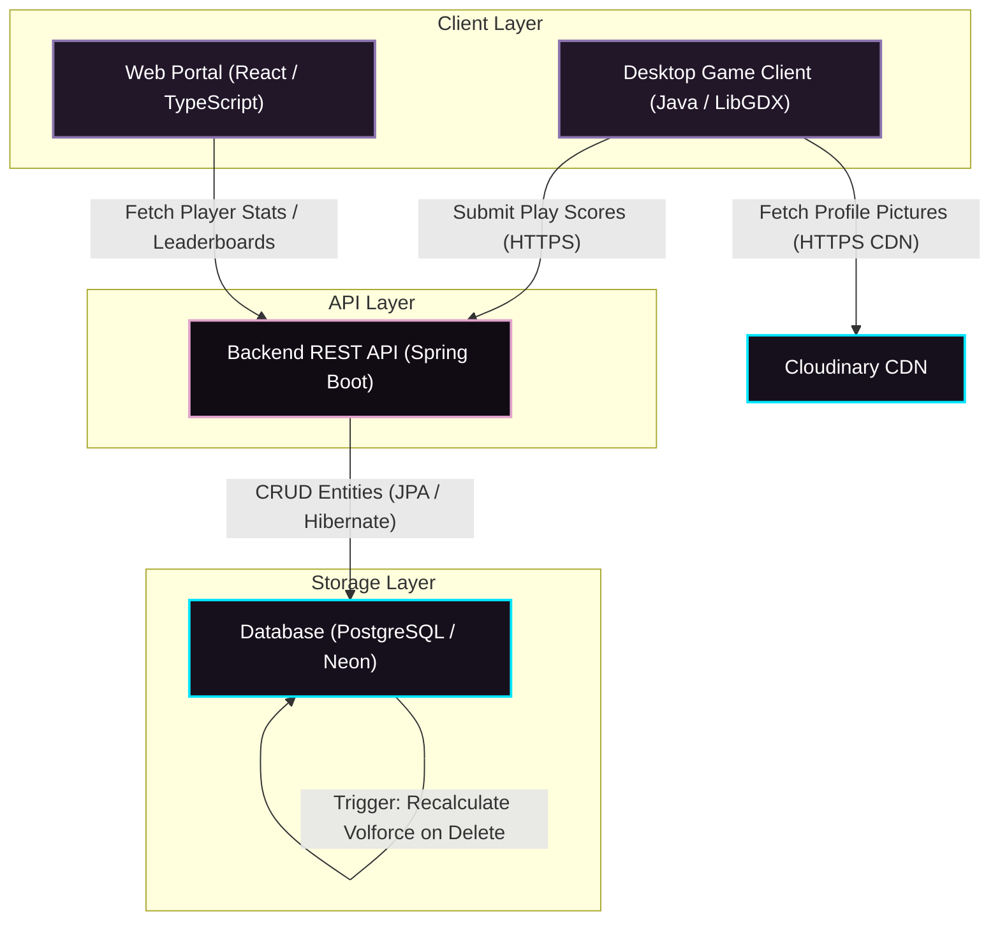
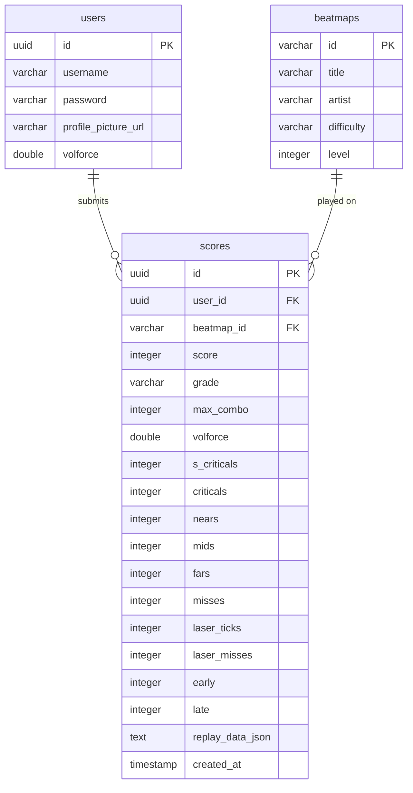
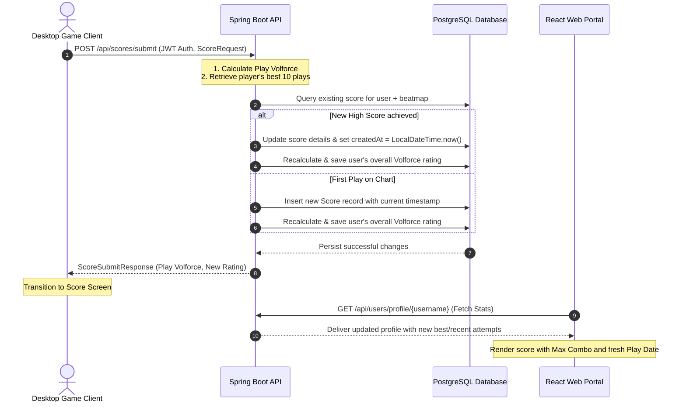
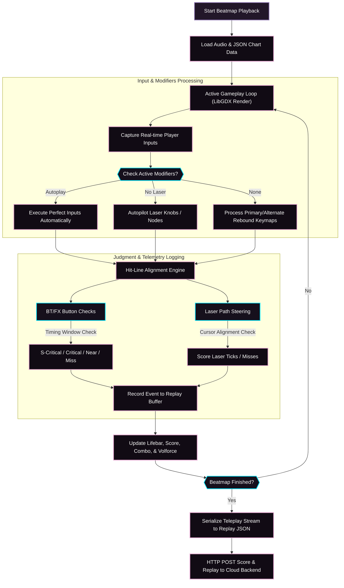

# NodeVoltex


Welcome to **[NodeVoltex](https://node-voltex.vercel.app/)**, a premium, modern rhythm game ecosystem built to deliver an elegant, highly responsive competitive experience. 

---

## Getting Started

### Chart Setup & Playing Beatmaps
> [!IMPORTANT]
> **Beatmap Installation Directory**:
> To be able to load and play charts in NodeVoltex, you must place your extracted beatmap folders inside a folder named **`songs/`** located in the same directory as the executable file (`NodeVoltex.exe` or compiled `.jar` runner).
> 
> ```text
> 📂 NodeVoltex/
>  ├── 📄 Node.Voltex-1.x.x.exe (or Node.Voltex-1.x.x.jar)
>  └── 📂 songs/
>       ├── 📂 songtitle1/
>       │    ├── 📄 mxm.json
>       │    ├── 📄 jak.png
>       │    └── 📄 audio.ogg
>       └── 📂 songtitle2/
>       │    ├── 📄 nov.json
>       │    └── ..
>       └── 📂 ..
> ```

---
## Screenshots
For Documentation.


---

## Repository Structure

NodeVoltex is composed of the following core directories:

*   **[`Game`](file:///e:/College/Semester%204/Netlab/game/NodeVoltex/NodeVoltex/Game)**: A high-performance 2D rhythm game client written in Java using the LibGDX framework.
    *   *Features*: Custom key mapping engine, robust texture decoders supporting automated WebP URL formatting, error-handling overlays for Render host wake-ups, and precise local performance caching.
*   **[`Portal`](file:///e:/College/Semester%204/Netlab/game/NodeVoltex/NodeVoltex/Portal)**: A modern, visually stunning React web application built with TypeScript, Vite, and custom CSS variables.
    *   *Design*: Sleek, competitive flat-aesthetics in a dark plum and violet palette matching the game's official backgrounds. Includes a scalable vertically-scrolling Song Packs grid download section, overall user rankings leaderboard, and comprehensive profile dashboards showcasing player Volforce, best plays, and recent attempts history.
*   **[`Backend`](file:///e:/College/Semester%204/Netlab/game/NodeVoltex/NodeVoltex/Backend)**: A high-throughput Spring Boot REST API backed by a PostgreSQL database.
    *   *Features*: Secure JWT player session managers, dynamic Volforce rating calculation services, and automated database triggers to maintain score deletes and overall rating synchronization.

---

##  Key Features

### Fully Customizable Gameplay
*   **Tailored Performance Layouts**: Complete control over your playfield environment. Customize gameplay settings directly from the client, including playfield width, scroll speed, background dim level, and so on.
*   **Mods**: Experiment and practice charts using mods like Autoplay (the map will play itself perfectly) and No Laser (automatic laser).
*   **Key Mapping**: Freedom to rebind input keys (A-Z, 0-9, Space) with primary and alternate configuration slots, featuring automated input collision prevention rules.

### Online Ecosystem & User Profiles
*   **Integrated Accounts & Personalization**: Register a personal profile and upload custom profile pictures (avatars), securely managed through JWT authentication sessions.
*   **Automated Volforce Rating System**: Performance rating is calculated dynamically using a competitive mathematical formula (taking into account map difficulty, score value, and chart clearance tier e.g., UC/PUC) based on your top 10 plays.
*   **Online Leaderboards**: Every map features an online leaderboard displaying real-time high-score ranks, grades, judgments (Criticals, Nears, Misses, Laser ticks), play timestamps, and secure replay recordings.
*   **Replay Recordings**: The ability to watch how a player plays in-game on any map leaderboard.

### Companion Web Portal
The official **[NodeVoltex Web Portal](https://node-voltex.vercel.app/)** acts as the central companion hub, offering:
*   **Global Rankings**: A real-time leaderboard ranking the community by overall best 10 charts performance (Volforce rating).
*   **Comprehensive Profile Stats**: Interactive dashboards displaying players' overall status, Top Plays, and Recent Scores attempts history.
*   **Song Packs Distribution**: A scalable distribution center containing official release maps and expansion packs for immediate download and gameplay installation.

---

## System Diagrams & Workflows

To better understand the ecosystem, here is how the frontend, game client, REST API, and data layer coordinate.

### 1. Overall System Architecture
Shows the relationship between the client layer, REST services, media CDN, and database storage.



### 2. Database Entity Relationship Diagram (ERD)
Details the relational database schema, key mappings, and table fields that power the NodeVoltex competitive profiles.



### 3. High Score Submission Sequence
Illustrates the exact workflow when a score is registered, saved, rating recalculated, and visualized in the portal.




### 4. Interactive Gameplay Loop & Telemetry Engine
Illustrates the inner mechanics of the game client render loop, note judgment calculations, laser steering tracker, and the telemetry logging system that generates replay data.



#### Detailed Mechanical Analysis
*   **The Hit-Line Judgment System**: The client tracks individual note vectors (short BT, long FX, and Laser nodes) advancing down the 3D-perspective lane. When an input matches the target column at the precise timestamp window relative to the song clock, judgments are registered (`S-Critical` for sub-millisecond precision, `Critical`, `Near`, or `Miss`/`Error`).
*   **Steered Laser Path Tracking**: Laser tracks are composed of linear vector coordinates. As long as a laser segment remains active on the lane, the gameplay engine checks if the player is actively steering the mapped analog knob/cursor key within a safe margin of the target coordinate. Success increments the `laser_ticks` tally; failure breaks the chain and registers `laser_misses`.
*   **The Replay Serialization Engine**: Every keyboard/laser knob action, judgment offset, and score state update is pushed to a real-time event telemetry buffer. When the chart finishes, this buffer is packed and serialized into a lightweight, high-performance compressed JSON string (`replay_data_json`). Uploaded to the backend REST API, this allows other users to watch high-fidelity replays rendered directly in-game by fetching and decoding the recorded telemetry inputs.
*   **Autoplay & Practice Modifiers**: Modifiers intercept the input processor. **Autoplay** routes perfect hit signals directly to the alignment engine, bypassing manual keystrokes entirely, while **No Laser** isolates the knob components, granting laser alignment ticks automatically so that players can isolate and learn complex button patterns.

---

## Tech Stack

*   **Frontend**: React, TypeScript, Vite, Vanilla CSS, Lucide icons.
*   **Backend**: Spring Boot 3.x, Spring Data JPA, PostgreSQL (Neon DB).
*   **Game Client**: LibGDX Framework, Java.
*   **Database Sync**: PostgreSQL PL/pgSQL database triggers.